### TLDR;

- **Efficiency at scale matters**: Small reductions in resource usage can have massive implications on cost and efficiency
- **Benchmarking OTel \+ ClickHouse**: We construct a pipeline to benchmark streaming trace data into ClickHouse
- **Rotel scales 4x**: We explore how we scaled from 137K trace spans/sec per-core with the OTel Collector to 462K trace spans/sec per-core with Rotel, detailing several key performance improvements
- **Tools and resources**: Find the tools we used to drive our benchmark evaluation

<!-- truncate -->

:::info

This blog post originally appeared as a [guest post](https://clickhouse.com/blog/otel-to-rotel-petabyte-scaling-tracing-4x-greater-throughput) on the ClickHouse blog.

:::

## Introduction

Operating an observability platform at petabyte scale demands constant, deliberate attention to resource efficiency. Even small improvements in per-core performance or memory consumption can translate into significant reductions of infrastructure costs.

This post grew out of a [talk](https://www.youtube.com/watch?v=ODjPgbet-oI) we gave at a ClickHouse meetup in Denver. We presented our work on [Rotel](https://rotel.dev/), an OpenTelemetry data plane designed for high performance in large scale systems.

ClickHouse is increasingly chosen for large-scale OpenTelemetry workloads because of its high compression and cost efficiency, while the OTel Collector often emerges as the most expensive part of the pipeline.

Recently, ClickHouse published an [article](https://clickhouse.com/blog/scaling-observability-beyond-100pb-wide-events-replacing-otel) on the importance of efficiency at scale and their experience operating OTel on their internal platform LogHouse.

One detail of the post stood out:

:::note[`“...”`]
 _OTel Collectors: Use over 800 CPU cores to ship 2 million logs per second._
:::

At roughly 2.5k logs per sec per core, for average log lines this would translate into just 10MB per sec on an 8-core box, which is far below what modern hardware can sustain. ClickHouse can [process](https://clickhouse.com/blog/scaling-observability-beyond-100pb-wide-events-replacing-otel#20x-more-data-90-less-cpu-the-numbers-behind-our-rewrite) over 12.5k OTel events per second per core, more than five times the ingestion rate, leaving ingestion as the limiting factor rather than storage. While we can not reproduce ClickHouse’s own internal platform, we felt it was worth benchmarking modern OpenTelemetry pipelines. So for the talk we wanted to explore a central question: **How do different OpenTelemetry data planes perform when sending tracing data to ClickHouse?**

This post walks through our benchmark comparing the OpenTelemetry Collector and Rotel using a synthetic tracing pipeline that streams trace spans through Kafka and writes them to ClickHouse. After benchmarking the OTel collector at **1.1M spans/sec**, we walk through how we scaled Rotel to handle up to **3.7M spans/sec** on the same hardware by implementing **JSON binary serialization**, **perf analysis of Tokio task management**, and leveraging **improved LZ4 compression**.

Our benchmark framework and tools are presented at the end.

## Benchmark framework

Before we walk through the results, let’s cover a bit of what and how we intend to evaluate the OpenTelemetry collector and Rotel. You can jump directly to the test results if you’d like instead, [here](#testing-opentelemetry-collector).

### Tracing pipeline

We focused our benchmark on writing trace spans to ClickHouse, since trace data grows quickly in large systems. We decided to model our benchmark after a highly reliable streaming pipeline, using Kafka as the log streaming tier. The goal was to represent a system where a larger number of edge collectors publish data to a stream consumed by a smaller number of collectors that write batch data efficiently to ClickHouse. In the pipeline both Rotel and the OTel Collector support the same Kafka Protobuf encoding, so they are interchangeable


### Evaluation approach

Our goal was to determine the **maximum throughput a single collector could sustain** on fixed hardware, focusing on efficiency rather than scaling up or out. We wanted to see how far one node could be pushed before degrading, while staying within our evaluation budget. We centered the test on the gateway collector because it exports directly to ClickHouse, which performs best with large batch inserts. Maximizing batching efficiency favors running fewer, larger gateway collectors, so this was the component we optimized and measured.

**Detecting Saturation**

We identified two signals that would indicate we had hit the maximum capacity a collector could handle:

1. **Memory growth** \- Collectors internally buffer payloads in the face of back pressure from downstream components, which shows up as a rapid increase in memory usage.
2. **Kafka consumer lag** \- When a collector can’t keep up with incoming messages, its Kafka consumer lag grows \- the time gap between the last read message and current wall time.

**Test Setup**

For each test we ran the pipeline at a point just below saturation for a total of 15 minutes, recording two metrics:

- **Trace spans/sec**, as recorded by the load generator
- **MB/sec ingest into ClickHouse**, as measured by AWS Cloudwatch

Aggregate bandwidth helps provide a normalized throughput metric, given trace spans can have large variations in size between environments. In our pipeline configuration the single edge collector would emit optimized batches to Kafka, reducing overall message count while increasing individual message size.

For each test we capture the average CPU for Rotel and ClickHouse.

### OpenTelemetry ClickHouse schema

For our benchmark we used a single ClickHouse data schema that is compatible with both the OpenTelemetry collector and Rotel. This [schema](https://clickhouse.com/docs/use-cases/observability/clickstack/ingesting-data/schemas) is recommended for use with ClickHouse and the ClickStack observability solution, for OTel metrics, logs, and traces.

The OTel data model relies heavily on key/value attributes to represent the unique properties of infrastructure and application environments that are important for analysis. In the original ClickHouse schema these fields were stored using the [Map column type](https://clickhouse.com/docs/sql-reference/data-types/map), but a recent feature flag of the OTel collector updates this schema to use the new [JSON column type](https://clickhouse.com/blog/a-new-powerful-json-data-type-for-clickhouse). The JSON column type places a heavier CPU load on ClickHouse, yet allows more flexible and expressive queries. For our evaluation we chose to use the new JSON column type. You can find the full ClickHouse trace schema we used [here](https://gist.github.com/mheffner/dc332a61f3b9ba1d03fd7c7d5c1b7fbb).

A key part of our setup was the ClickHouse Null table engine, which let us remove disk I/O from the benchmark. The Null engine accepts writes but discards them immediately, so we could measure ingestion throughput and validate schema correctness without storage latency. After identifying the pipeline’s peak throughput, we can focus on scaling ClickHouse to handle real disk writes.

### Load generation

We were unable to push the necessary data volume required through the [telemetrygen](https://pkg.go.dev/github.com/open-telemetry/opentelemetry-collector-contrib/cmd/telemetrygen) CLI for the benchmark. Instead, we relied on an internal load generator we had built previously for testing OpenTelemetry and other telemetry pipelines. You can find the project in the [otel-loadgen](https://github.com/streamfold/otel-loadgen) Github repo. It includes additional features for verifying end-to-end data delivery, which we’ll cover in a future post.

We generated approximately 100 spans per trace with varied attributes and metadata. As with any synthetic load test, the dataset won’t identically mirror real production traffic.

### Evaluation hardware

All benchmarks were performed on AWS EC2 instances. Each tier of the evaluation pipeline was run on a separate instance and all instances were created in the same availability zone.

|                   | Instance    | vCPU | Memory (GiB) |
| :---------------- | :---------- | ---: | -----------: |
| Load generator    | m8i.8xlarge | 32   | 128          |
| Edge collector    | m8i.4xlarge | 16   | 64           |
| Kafka             | i3.xlarge   | 4    | 30           |
| Gateway collector | m8i.2xlarge | 8    | 32           |
| ClickHouse        | i3.4xlarge  | 16   | 122          |

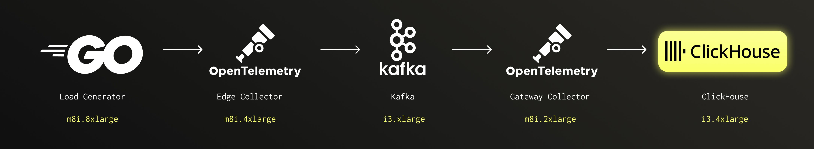

For Kafka and ClickHouse we mounted the data volumes on the instance storage NVMe drives for maximum disk throughput. We used the Amazon Linux 2023 distribution and Docker Compose to run the components.

The goal of these benchmarks were to find what the maximum throughput we could push through a single gateway collector box. We decided on the m8i.2xlarge, a box with 8 cores and 32GB of memory. We had to expand other boxes in the pipeline as we grew, but the gateway collector we kept at an m8i.2xlarge.

## Testing OpenTelemetry Collector

We started our benchmark with the OpenTelemetry Collector, running in the benchmark as both the edge collector and gateway collector.

### Set up

**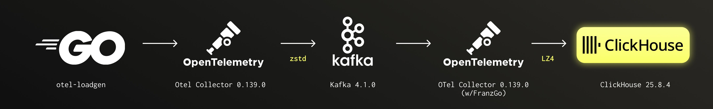**

_You can find the docker-compose config [here](https://github.com/streamfold/rotel-clickhouse-benchmark/blob/main/docker-compose-otelcoll.yml)._

### Results

| OTel Collector           | Trace Spans | Trace Spans / Core | ClickHouse Network In (compressed) |
| :----------------------- | :---------: | :----------------: | :--------------------------------: |
| Single Collector Process |  700 K/sec  |     87.5 K/sec     |              40 MB/s               |
| Dual Collector Processes |  1.1 M/sec  |    137.5 K/sec     |              69 MB/s               |

Running a single instance of the collector we initially hit a cliff around 700k spans/sec (40MB/s). Beyond that point, the collector’s memory footprint began to grow steadily, even though CPU utilization was only around 50%.

The OpenTelemetry Kafka receiver processes messages in a single goroutine, which likely limited how much traffic it could handle. We experimented with a few Kafka configuration options, including message size parameters, but none noticeably improved throughput. Instead, we scaled horizontally by running a second collector instance on the same box (`scale: 2` in our Docker Compose setup).

With two collector processes running, each consuming half the Kafka partitions, the highest throughput we could maintain before saturation was **1.1M trace spans/sec (69MB/s)**. Past that point the sending queue began to fill and memory usage increased rapidly. When the sending queue was entirely full the Kafka receiver would continue to read messages, but drop them immediately. **This meant that the consumer lag didn’t grow, but we were also losing data\!**

CPU on the gateway collector peaked at a little over 83% during the test and appeared to be the limiting factor. ClickHouse CPU sat around 23%.

|     | Rotel | ClickHouse |
| :-- | :---: | :--------: |
| CPU | 83.1% |   23.8%    |


## Testing Rotel

### Set up

****

_You can find the docker-compose config [here](https://github.com/streamfold/rotel-clickhouse-benchmark/blob/main/docker-compose-rotel.yml)_.

### Results

| Rotel                | Trace Spans | Trace Spans / Core | ClickHouse Network In (compressed) |
| :------------------- | :---------: | :----------------: | :--------------------------------: |
| Single Rotel Process |  750 K/sec  |    93.75 K/sec     |             41 MB/sec              |
| Dual Rotel Processes | 1.45 M/sec  |    181.3 K/sec     |             76 MB/sec              |

Rotel has a single receiver loop that pulls messages from Kafka, similar to the OTel collector. This led us to believe we had a **serial processing bottleneck**, which was initially confirmed when we were able to scale to the full instance CPU running two instances of the Rotel process.

With dual Rotel processes, we were able to push up to **1.45M trace spans/sec (76 MB/sec)**, about a **1.3x improvement** on total throughput from the OTel collector. Past 1.45M we noticed Kafka consumer lag slowly increase, implying that we were unable to consume from Kafka fast enough.

At 1.45M trace spans/sec, CPU on the gateway collector instance became a bottleneck, with ClickHouse CPU rising to about 60%.

|     | Rotel | ClickHouse |
| :-- | :---: | :--------: |
| CPU | 91.3% |   60.4%    |


We continued to search for optimization opportunities, which turned our attention to how we were sending JSON column types.

## Improving RowBinary JSON

In Rotel we use a modified version of the official Rust ClickHouse crate, [`clickhouse-rs`](https://github.com/ClickHouse/clickhouse-rs). The `clickhouse-rs` crate uses RowBinary, a row-oriented, binary serialization format transmitted over HTTP, to write and read data from ClickHouse. In contrast, the OTel Collector’s Go driver and ClickHouse’s internal server communication use the column-oriented native protocol.

When working with JSON column types, the `clickhouse-rs` crate [recommends](https://github.com/ClickHouse/clickhouse-rs/blob/main/examples/data_types_new_json.rs) serializing values to a JSON string before sending them over the wire. ClickHouse does not store JSON columns as raw strings, so this stringification step is only for transport, but it still adds overhead. The client must serialize the JSON, and the server must parse it again. This requires scanning JSON keys and string values to escape characters such as quotes and backslashes, which becomes expensive on large strings at high throughput.

With help from the ClickHouse Slack community, we discovered that JSON columns can be encoded in the native RowBinary format instead. A JSON column is encoded as a sequence of key and value pairs. You write the string key, followed by a type tag for the value, followed by the raw value itself. This avoids JSON serialization costs and lets us stream structured data directly to ClickHouse.

For example, take the simple JSON object:

```json
{
  "a": 42,
  "b": "dog",
  "c": 98
}
```

The RowBinary encoding for that looks like:

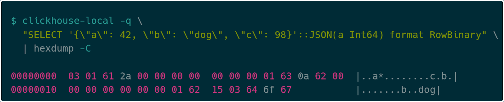

JSON RowBinary first encodes the number of key/value pairs as a variable-length integer (varint), so `03` pairs, followed by the encoding for each key/value pair. For a given key/value pair the encoding uses a varint for the key length, `01` here, followed by the string bytes, finally followed by the value encoding. If the type of the value is known in the JSON type declaration, like `a` is in the example above, then it encodes that type directly, `2a 00 00 00 00 00 00 00` for the value `42`. If the type is not declared, it uses the [Dynamic Type encoding](https://clickhouse.com/docs/sql-reference/data-types/data-types-binary-encoding). For example, the key `c` uses the encoding `0a` to indicate an Int64, followed by the value `98` (`62 00 00 00 00 00 00 00`). Finally, the key `b` is followed by `15` to indicate that the value is of string type, followed by the length of the string `03`, then the string “dog”.

This is much more efficient, reducing any serialization/deserialization time for both client and server. While this JSON encoding is not supported in the `clickhouse-rs` crate yet, we plan to help contribute support soon.

### Rerunning the test

After updating Rotel to use this improved [encoding approach](https://github.com/streamfold/rotel/pull/200), we reran our tests to measure the impact. The results showed that we were not able to exceed the previous peak of 1.45M spans per second, but we did observe roughly a **10% reduction in CPU usage** on the ClickHouse server and a small reduction in CPU on the gateway collector. This reduction appeared consistently across multiple runs, which suggests that the lower server-side deserialization cost provided a real benefit.

The synthetic load used in this evaluation does not contain large string values, and the number of attributes per span may differ from production workloads. Although we did not see a significant improvement on the client side, we believe the faster JSON serialization and deserialization path will be more noticeable for spans that contain larger attribute sets.

|     | Rotel | ClickHouse |
| :-- | :---: | :--------: |
| CPU | 88.5% |   50.7%    |


## Doubling throughput with one weird trick (finding and resolving allocator lock contention)

At this point in our testing we required two instances of Rotel on the gateway collector to saturate the host’s 8 vCPUs and achieve 1.45m events/sec into ClickHouse. The Rotel Kafka receiver ran in a single Tokio task, that when simplified, looked something like this.


There are two problems with this approach:

1. Each step must be done sequentially, i.e. no parallelism.
2. Unmarshaling is an expensive CPU-bound computation that has the potential to block Tokio executor threads.

Tokio is an asynchronous runtime for the Rust programming language that relies on cooperative scheduling. That means that tasks are expected to voluntarily yield control back to the runtime at `.await` points or other yield points. There are [numerous articles](https://ryhl.io/blog/async-what-is-blocking/) on the internet that explain the importance of this contract and the potentially disastrous implications of ignoring it. However, suffice it to say, a tokio task "should never be too far away from an .await point" and a good rule of thumb is to never spend more than 10 to 100 microseconds between each `.await`.

Throughout Rotel's exporters we use a separate thread pool for the CPU intensive work of marshaling and compressing outgoing request payloads. With our Kafka receiver, payloads are decompressed in a background thread of the [rust-rdkafka library](https://github.com/fede1024/rust-rdkafka) before they reach the `recv()` call. In our initial Kafka receiver implementation we had kept the work of unmarshaling the incoming payloads in the Tokio async task. After determining this unmarshaling was CPU intensive, we updated the Kafka receiver to use the same thread pool as the exporters for running blocking tasks.

After refactoring, the receiver's main processing loop looked something like:

```
loop {
  select! {
    message = recv() => {
      unmarshaling_futures.push(spawn_blocking(unmarshal(message)))
    },

    unmarshaled_res = unmarshaling_futures.next() => {
      send_to_pipeline(unmarshaled_res)
    }
  }
}
```

We then reran the tests with a single Rotel process on the gateway collector. We restarted our load generator at the previous maximum of 1.45M trace spans/s and were able to process the same throughput as before. However, we were shocked to find that the **CPU load had dropped 40%\!**

Previously it took two Rotel instances to saturate the vCPUs, which suggested that the Kafka receiver was hitting a serial bottleneck. Adding parallelism by moving marshaling work into separate threads should have removed that limitation. We expected that a single Rotel instance, with the bottleneck resolved, would reach the same throughput as two instances and show similar CPU usage.

With CPU load now significantly lower than before, we continued to increase the throughput. **We were able to increase throughput by 2x from 1.45M to 3.6M trace spans/s\!**

| Rotel                | Trace Spans | Trace Spans / Core | ClickHouse Network In (compressed) |
| :------------------- | :---------: | :----------------: | :--------------------------------: |
| Single Rotel process |  3.6 M/sec  |     450 K/sec      |             204 MB/sec             |

At 3.6M trace spans/s we again reached CPU saturation around 93%.

|     | Rotel | ClickHouse |
| :-- | :---: | :--------: |
| CPU | 93.7% |   55.7%    |


With the performance gains confirmed, our next step was to understand what drove the improvement in CPU efficiency. To do this, we turned to detailed profiling, comparing the old and new builds using Linux Perf and flame graphs to visualize where CPU time was being spent.

### Profiling Rotel’s Kafka receiver with flamegraphs

We reran the tests against the old and new version of Rotel’s Kafka receivers and this time captured some flamegraphs. On first inspection, nothing immediately jumped right out to us. Can you spot it? In both versions we can clearly see that preparing and exporting traces to ClickHouse is dominating runtime and we’re also spending a fair amount of time unmarshaling messages at the receiver (the unmarshaling occurs in the `prost::message::Message::decode` routine). The workload generates a lot of short lived objects, so we spend a lot of time allocating and freeing memory.

**Old:**

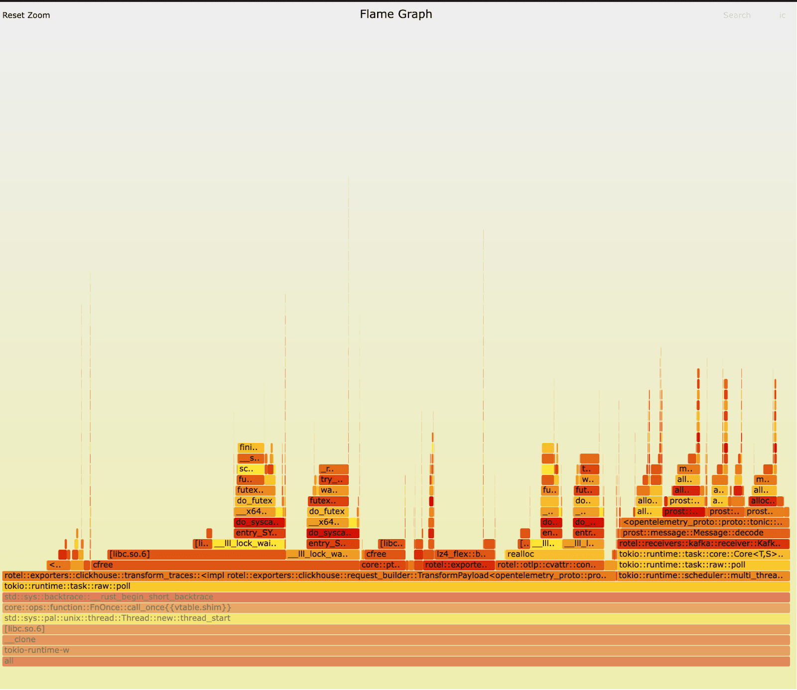

**New:**

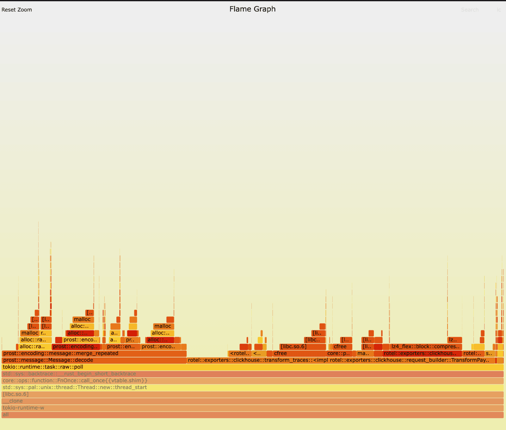

### Profiling Kafka receiver changes with Linux Perf

Running Linux perf stat showed some striking differences between the builds.

```bash
perf stat -c cycles,instructions,cache-misses,cache-references,context-switches,cpu-migrations
```

**Old:**
```
295612663445 cycles
264853636815 instructions # 0.90 insn per cycle
615670230 cache-misses # 32.963 % of all cache refs
1867733351 cache-references
1224819 context-switches
1230 cpu-migrations
50.296446757 seconds time elapsed
```

**New:**
```
150590256805 cycles
287007890213 instructions # 1.91 insn per cycle
598469068 cache-misses # 51.429 % of all cache refs
1163669589 cache-references
37675 context-switches
43 cpu-migrations
43.716966122 seconds time elapsed
```

The new build is averaging 1.9 instructions per cycle with only 862 context switches/sec \- not amazing for instruction-level parallelism (ILP), but not terrible. The old version was averaging .9 instructions per cycle and an astounding 24,350 context switches/sec, that’s a **32.5x decrease in context switches in the new build\!** Essentially we were getting no ILP and we were constantly parking and unparking threads. Further, the new version averages 1 cpu migration/sec, showing excellent cache affinity while the old version averaged 24.5 migrations/sec \- that’s a **24.5x decrease in the new build** indicating the scheduler couldn’t keep threads on the same cores in the old build.

The new version shows much better parallelization characteristics, allowing us to ramp our throughput even further than before. However, all we did was just move some work to different threads.

We could assume the poor performance in the old version was likely due to blocking Tokio executor threads, thereby creating additional overhead in polling, spinning, and attempted work stealing. However digging into the results of a perf report led to our actual more nuanced answer.

### Digging into profiles with Linux Perf Report

After running the tests again with a perf record we had a much more detailed view of the old new and old builds. The new version looks pretty healthy. We’re spending most of our time in compressing data for exporting, transforming OTLP into rows for ClickHouse, and allocating and deallocating memory.

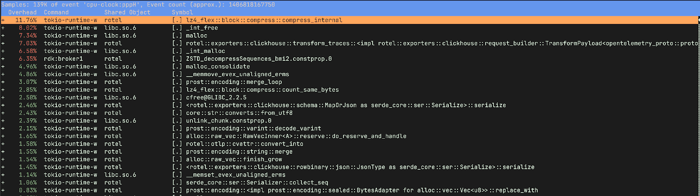

However the old version has quite a different story. It spent 15% of the time freeing memory and only 9.75% of its time compressing and preparing data for ClickHouse, as opposed to \~20% in the new version. We were also spending a lot of time in `_raw_spin_unlock_irqrestore`, `finish_task_switch.isra.0`, `__lll_lock_wait_private` and `__lll_lock_wake_private`.

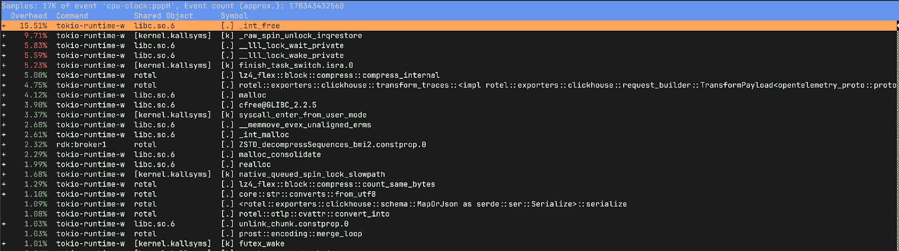

If we view the report with children, we can see the time spent waiting on locks was happening when we were attempting to free memory.

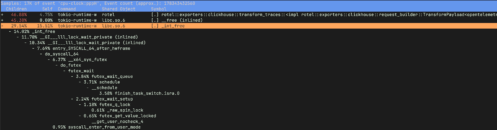

**So what do these functions do?**

`_raw_spin_unlock_irqrestore` is a Linux kernel function that re-enables interrupts and releases a spinlock, restoring the interrupt context to what it was before a corresponding `_raw_spin_lock_irqsave` call. More importantly `_raw_spin_unlock_irqrestore` is called when a task is about to be preempted, allowing the scheduler to perform a context switch. `finish_task_switch.isra.0` on the other hand is the compiler optimized version of finish_task_switch which performs cleanup and post context-switch actions.These functions correspond to the massive increase in context switches we observed in the older version.

`__lll_lock_wait_private` and `__lll_lock_wake_private` are internal, low-level functions within glibc and are related to the implementation of mutexes and other synchronization primitives. **What’s interesting here is that we see the locking showing up when attempting to free memory.**

In retrospect, looking back at our old version’s flamegraph, the problem is obvious. Ideally we’d have used a tool like [differential flame graphs](https://www.brendangregg.com/blog/2014-11-09/differential-flame-graphs.html) to compare the two flame graphs side by side making it easier to spot the difference (my kingdom for more, easy to use, flame graph tooling). Fortunately we quickly uncovered the root cause with perf stat and perf record. **The contention is in the ClickHouse exporter marshaling functions (TransformPayload) rather than the Kafka receiver.**

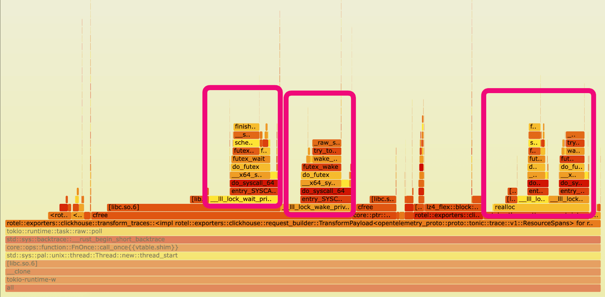

### Glibc multi-threaded allocation

So now it’s clear why our changes caused CPU utilization to drop while throughput improved. The old version was doing a lot of work, just not the type of work we wanted to be doing\! Essentially the old version was spin locking attempting to free memory.

To understand what was going on requires a brief understanding of how the glibc allocator works. Memory is separated into regions called “arenas”, each of these arenas has a mutex lock protecting both allocation and deallocation. Where possible threads will attempt to create separate arenas to avoid lock contention, with the number of allocated arenas growing as a thread pool increases. However, if deallocation occurs on a different thread to the one on which allocation was performed, then the de-allocating thread will have to lock the owning arena \- causing other threads to wait and thus contention. In our older version, we allocated our memory for processing trace data during the Kafka receiver’s unmarshaling routine on a Tokio executor I/O task. This work was scheduled on the reduced set of Tokio async executor threads, for which there were only eight, one per core, on the gateway collector node. Later in the pipeline that memory was deallocated as part of the ClickHouse exporter request marashaling, which executed as a blocking task on a much larger thread pool \- 10s to 100s of threads.

Here’s an illustration of the data flow and locking pattern running on a two-core box with just two Tokio async executor threads:

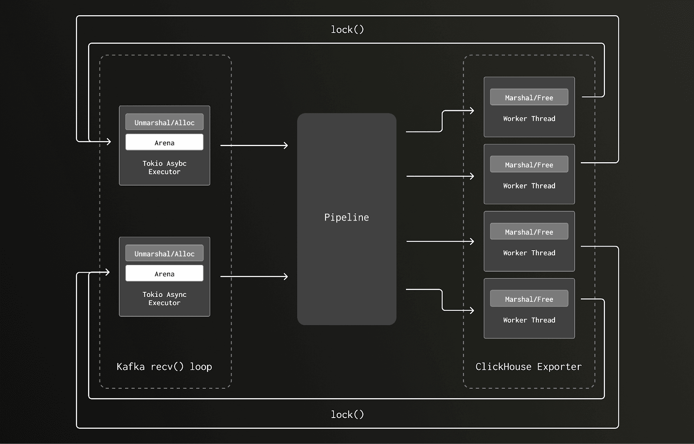

In the new version, the allocations occurring during the CPU bound Kafka receiver unmarshaling routine executes on the same, much larger, thread pool as the deallocation was occurring. As the pipeline volume grows, increasing the amount of unmarshaling/marshaling, the blocking thread pool grows. This increases the number of arenas, reducing the chance of lock contention.

The pipeline now appears more like this:

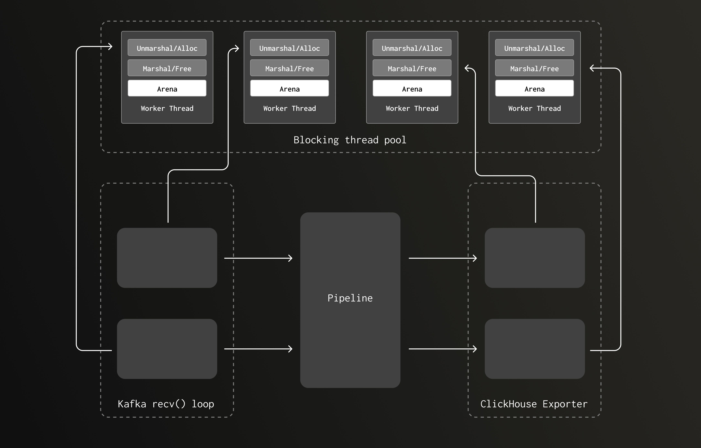

### Confirming arena lock contention with jemalloc

A helpful early reviewer of this post posed the question “I’m curious if this phenomenon reproduces on jemalloc?”. [Jemalloc](https://jemalloc.net/) is a general purpose malloc implementation that is specifically designed to reduce lock contention for threaded programs on multi-processor systems. We had tested Rotel with jemalloc in the past and found no significant performance wins. However, our ClickHouse exporter workload combined with the recent Kafka receiver, clearly puts pressure on allocation so we were keen to try running both the old and new versions with jemalloc.

After modifying the previous version with an older task scheduling model to use jemalloc, **we saw a reduction in CPU utilization from 93% to 40%. This reduction matched what we saw moving the unmarshaling to the shared thread pool, confirming our findings.**

Although jemalloc lowered CPU usage in the previous version, it introduced higher Kafka lag at full throughput. Combined with the fact that jemalloc is [no longer actively maintained](https://jasone.github.io/2025/06/12/jemalloc-postmortem/), we do not plan to adopt it as the default allocator. We may add feature flags so users can opt in to custom allocators such as jemalloc or mimalloc when needed.

## Fast LZ4 compression for an additional push

Rotel uses the recommended LZ4 compression setting for ClickHouse payloads to reduce over-the-wire data transfer. It leverages the same `lz4_flex` crate that `clickhouse-rs` uses, but we had imported it directly. When we pulled over the compression support that relied on the [`lz4-flex`](https://github.com/PSeitz/lz4_flex) crate, we failed to notice the feature settings in the Cargo.toml import.

The `lz4-flex` crate has both unsafe and safe implementations, with the unsafe versions providing slightly improved performance (read about Rust unsafe [here](https://doc.rust-lang.org/book/ch20-01-unsafe-rust.html)). With `lz4-flex`, you must opt-in to the unsafe, faster, variant of the library.

The `clickhouse-rs` crate opts into the unsafe variant of `lz4-flex`, but we had missed that. Enabling that provided a slight additional boost, taking our gateway collector throughput from **3.6M to 3.7M trace spans/sec and 209 MB/sec.**

| Rotel                | Trace Spans | Trace Spans / Core | ClickHouse Network In (compressed) |
| :------------------- | :---------: | :----------------: | :--------------------------------: |
| Single Rotel process |  3.7 M/sec  |    462.5 K/sec     |             209 MB/sec             |

CPU also decreased just slightly on the gateway collector.

|     | Rotel | ClickHouse |
| :-- | :---: | :--------: |
| CPU | 90.8% |   57.8%    |


## Complete end-to-end evaluation

After working through multiple optimizations of Rotel and evaluating it against the Null table engine of ClickHouse, we were able to scale the single instance throughput of Rotel from an initial 1.1M trace spans/sec to a total of **3.7M trace spans/sec** or **462.5 K trace spans/sec per-core**. This is nearly over 4x the original 1.1 M/sec throughput we saw when testing the OTel collector.

We now turned our attention to the final piece which was getting the data permanently into ClickHouse and committed fully to disk. Scaling ClickHouse often comes down to optimizing the schema for both the incoming writes as well as your read queries. In our case we are using the default OTel schema, so our focus was primarily on selecting a box capable of sustaining the write load we had achieved.

To support the massive write load for this test we upgraded our ClickHouse instance. We ended up settling on the following AWS instance. To further remove the possibility of hitting disk utilization limits, we built a RAID0 mount across the four instance store disks.

| i4i.16xlarge | 64 cores | 512 MB | 4 x 3,750 AWS Nitro SSD |
| :----------- | :------- | :----- | :---------------------- |

While testing full ClickHouse writes to disk, we disabled Rotel's use of async inserts and significantly increased the batch size to improve write performance. We updated the Rotel configuration with `--clickhouse-exporter-async-inserts=false` and `--batch-max-size=102400`, which allowed us to reach the gateway collector’s previous throughput limit of 3.7 million trace spans per second.

ClickHouse CPU was about 50% with up to 210MB/s of compressed traffic.

|     | Rotel | ClickHouse |
| :-- | :---: | :--------: |
| CPU | 86.2% |    52%     |


### Visual inspection

We were able to see upwards of 3B trace spans in ClickHouse now\!

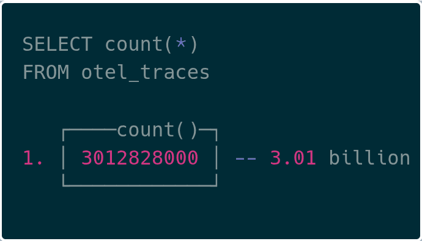

## Wrap up

### Efficiency at extreme scale

At the petabyte scale that ClickHouse runs their internal LogHouse platform, efficiency becomes a practical necessity. They improved their pipeline throughput 20x, while retaining just 10% of the capacity footprint they required before. If they were to continue on their previous trajectory, it would have been prohibitively expensive to operate. Other organizations like [Netflix](https://clickhouse.com/blog/netflix-petabyte-scale-logging) and [OpenAI](https://kccncna2025.sched.com/event/29Kgb), have also reached similar conclusions: that once you reach this level of volume, efficiency is critically important to the business. This is the context in which we have sought to improve the efficiency of OpenTelemetry collection and have developed Rotel.

### Near 4x efficiency improvement

This work pushed us to optimize Rotel into a high-throughput pipeline for streaming OpenTelemetry tracing data into ClickHouse. In our tests, Rotel reached nearly **four times the throughput** of the OpenTelemetry Collector on the same hardware, which can translate into meaningful resource savings at large scale. Rotel has first-class support for OpenTelemetry traces, metrics, and logs, and while this post focused on tracing, we plan to evaluate log and metric workloads as part of future benchmarking.

We are also interested in learning which capabilities matter most when operating at this level of volume. If you have ideas or want to share your own scaling challenges, you can join the community on [Discord](https://rotel.dev/discord) or contribute on [GitHub](https://github.com/streamfold/rotel).

### Further work

Here are some topics we would like to explore more after working on this post:

#### Deep dive on Kafka reliability

We only briefly touched on it in this post, but Rotel supports reliable delivery guarantees via end-to-end message acknowledgement, to ensure at-least-once delivery when streaming data from Kafka rather than relying on auto-commit which can easily result in data-loss . This support required a number of changes to the pipeline and rigorous testing to ensure Rotel does not drop data while also reducing duplicate deliveries. We would like to deep-dive into what reliable delivery means, how we built it, and the verification tools we built to test it. Look for a follow up post on this.

#### Explore ClickHouse native protocol

Rotel’s ClickHouse integration is built on the clickhouse-rs Rust crate, which uses the RowBinary protocol over HTTP. The OpenTelemetry Collector uses the Go ClickHouse driver, which communicates using the native ClickHouse protocol. The native protocol is the same one used for internal ClickHouse to ClickHouse transfers, and benchmarks have shown it to be more than [20 percent faster than RowBinary](https://clickhouse.com/blog/clickhouse-input-format-matchup-which-is-fastest-most-efficient#insert-performance-of-common-input-formats). ClickHouse has also added support for Apache Arrow Flight, which uses the Arrow in-memory format for efficient transport. We intend to evaluate moving from the row-oriented RowBinary format to one of the column-oriented formats, since they may provide another increase in throughput for Rotel. We plan to share our testing results in a future update.

#### Further exploring blocking tasks on tokio

Blocking tasks like deserializing payloads, can have large impacts on Tokio performance. It wasn’t until we worked through this benchmark that we discovered how much, so we want to find other potential impacts of this. We already know that Rotel’s OTLP receiver performs expensive Protobuf deserialization inline during the async task processing of the connection. This is built into the tonic crate, so we would like to explore how best to split this out. From some early analysis with the perf tools we think there may be big wins here.

#### Reducing memory allocation impacts

While Rust does not have a garbage collector, at high volumes memory allocation and deallocation still have a significant performance impact. In Rotel we are regularly cycling through memory allocations for short-lived objects as they move through the pipeline. Adopting a memory free list approach that allows us to skip the allocator for common reused buffers should cut performance overheads significantly. Of course, implementing it can be tricky and runs the risk of ballooning your memory usage if you’re not careful. This is another area where we may need to dive into the tonic crate to make necessary changes.

_We’d like to thank Sujay Jayakar, Ben Sigelman, Rick Branson, Vlad Seliverstov, Rory Crispin and Achille Roussel for reviewing early drafts of this post._

## Addendum

### Considered projects

While compiling these benchmarks we wanted to include other data planes that offered OpenTelemetry support, but found them incompatible with the benchmark. We chose distributed tracing for this evaluation because it is a strong driver for OTel adoption and data volumes can grow quickly at scale. However, logging and metrics are more classic monitoring telemetry, so many tools still have limited tracing support. While we didn’t have the capacity to include them in this post, we hope to explore logging and metrics benchmarks in the future.

#### Vector

[Vector](https://vector.dev/) is a lightweight tool built for constructing high-performance telemetry pipelines. It has extensive support for many sources and destination sinks, allowing it to integrate with many services and projects. Development is now driven by DataDog and Vector supports their observability pipelines product offering.

OpenTelemetry support in Vector is relatively new and not compatible with many destinations. The Vector data model did not originally have native support for traces, so OTel traces in particular have limited support. Given this, we were unable to evaluate Vector due to the lack of tracing support in both the Kafka and ClickHouse sinks.

- [Send traces from opentelemetry source to kafka sink](https://github.com/vectordotdev/vector/discussions/21018)
- [Storing trace spans in ClickHouse](https://github.com/vectordotdev/vector/issues/17307#issuecomment-1641075239)

#### Fluent Bit

[Fluent Bit](https://fluentbit.io/) is the alternative to Fluentd, written in C, that is focused on performance. Fluent Bit has inputs and outputs for OpenTelemetry data, supporting logs, metrics and traces. Fluent Bit can output and input data to Kafka, allowing you to build a reliable streaming pipeline. However, during our evaluation we [discovered](https://github.com/fluent/fluent-bit/issues/11121) that metrics and traces are not yet supported when connecting an OpenTelemetry input to the Kafka output nor via the HTTP output used for ClickHouse.

### Easy OTel ClickHouse migrations

The [ClickHouse docs](https://clickhouse.com/docs/observability/integrating-opentelemetry#out-of-the-box-schema) recommend that you disable auto schema creation in the exporter and populate the schemas ahead of time. It is not clear how best to deploy these schema migrations since they are bundled in the OTel exporter.

For Rotel we decided to split DDL management out to a separate CLI utility to make it easy to deploy these migrations. The [clickhouse-ddl](https://github.com/streamfold/rotel/blob/main/src/bin/clickhouse-ddl/README.md) tool will create schemas compatible with Rotel and the OTel collector.

We've shipped it as a docker container, so you can easily create the necessary tables for ingesting OpenTelemetry data. Here’s an example creating the tables necessary for storing trace spans:

```bash
docker run streamfold/rotel-clickhouse-ddl create \
   --endpoint https://abcd1234.us-east-1.aws.clickhouse.cloud:8443 \
   --traces --enable-json
```

You can also create the migrations with the Null table engine as we did during this post for benchmarking:

```bash
docker run streamfold/rotel-clickhouse-ddl create \
   --endpoint https://abcd1234.us-east-1.aws.clickhouse.cloud:8443 \
   --traces --enable-json \
   --engine Null
```

### References

- Benchmark framework: [https://github.com/streamfold/rotel-clickhouse-benchmark](https://github.com/streamfold/rotel-clickhouse-benchmark)
- Rotel: [https://rotel.dev](https://rotel.dev/)
- OTel loadgen: [https://github.com/streamfold/otel-loadgen](https://github.com/streamfold/otel-loadgen)
